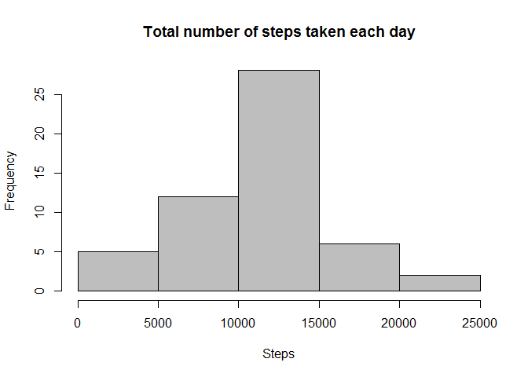
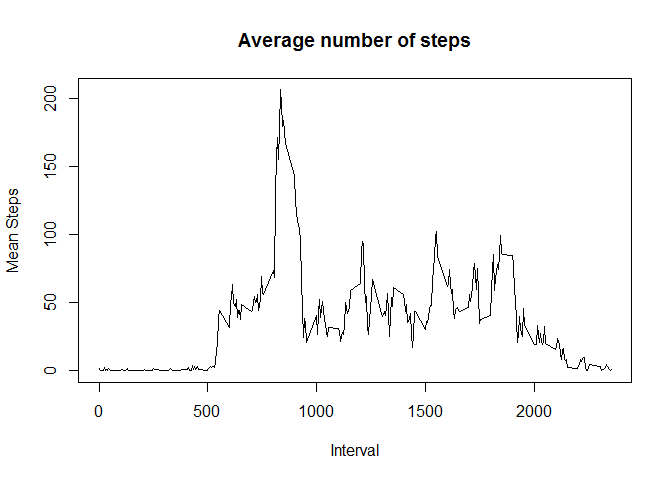
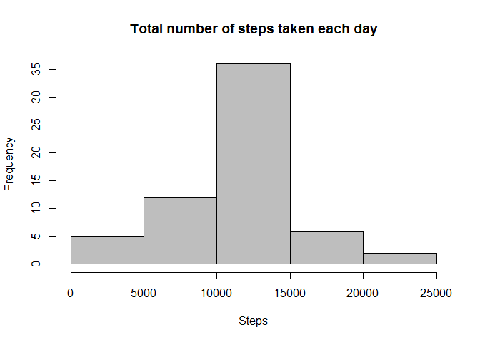
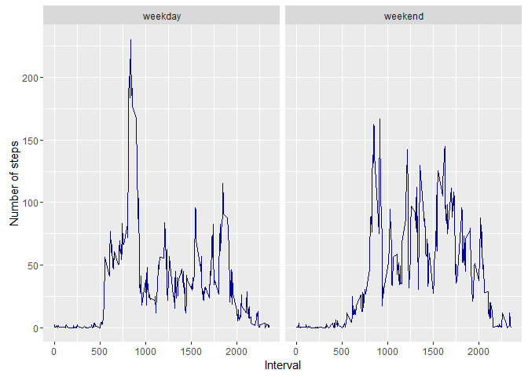

# Reproducible Research: Peer Assessment 1


## Loading and preprocessing the data


```r
    setwd("C:/Users/chaudharyan/Desktop/RepData_PeerAssessment1")
    file<-read.csv("./activity/activity.csv", header=TRUE)
```
## What is mean total number of steps taken per day?

 1. Ignore the missing values in the dataset.
 2. Calculate the total number of steps taken per day by aggregate()
 3. Make a histogram of the total number of steps taken each day
 4. Calcualte mean and median of the total number of steps taken per day

    

```r
    data<-na.omit(file)
    s<-aggregate(list(Steps=data$steps), list(Date=data$date), sum)
    hist(s$Steps, main="Total number of steps taken each day", xlab="Steps",col="grey")
```

<!-- -->

```r
    mean(s$Steps)
```

```
## [1] 10766.19
```

```r
    median(s$Steps)
```

```
## [1] 10765
```

## What is the average daily activity pattern?

1. Ignore the missing values in the dataset.
2. Calculate the average steps taken for each Interval by aggregate()
3. Create a plot of Interval and the average number of steps taken, averaged across all days


```r
data<-na.omit(file)   
m<-aggregate(list(MeanSteps=data$steps), list(Interval=data$interval), mean)
plot(m$Interval, m$MeanSteps, type="l", xlab="Interval", ylab="Mean Steps",main="Average number of steps")
```

<!-- -->


The Interval which has the maximum number of steps averaged across all days


```r
m[which.max(m$MeanSteps),]
```

```
##     Interval MeanSteps
## 104      835  206.1698
```


## Imputing missing values

1. Ignore the missing values in the dataset.
2. Filled NA's with means for that 5-minute interval and created a new dataset with these values
3. Creating histogram of total number of steps taken each day  


```r
    na_rows<-nrow(filter(file, is.na(file$steps)==TRUE))
```

Calcualting mean of every 5-minute interval and creating new dataset with missing value filled in with the mean


```r
    o <- na.omit(file) 
    Int_mean <- aggregate(list(Steps=o$steps), list(Interval=o$interval), mean)
    
    
    f<-file

    for(i in seq(0,2355,5)) 
    {
        f[f$interval==i & is.na(f$steps)==TRUE,1]<- Int_mean[Int_mean$Interval==i,2]
        
    }
    h<-aggregate(list(Steps=f$steps), list(Date=f$date), sum)
    hist(h$Steps, main="Total number of steps taken each day", xlab="Steps",col="grey")
```

<!-- -->

```r
    mean(h$Steps)
```

```
## [1] 10766.19
```

```r
    median(h$Steps)
```

```
## [1] 10766.19
```

When I compare the mean and median value calcualted above with the first part of asingnment, I find no difference in mean value and a very small difference in median value . 


First Part of assignment 

```r
    mean(s$Steps)
```

```
## [1] 10766.19
```

```r
    median(s$Steps)
```

```
## [1] 10765
```

Current Assignment 

```r
    mean(h$Steps)
```

```
## [1] 10766.19
```

```r
    median(h$Steps)
```

```
## [1] 10766.19
```

When I compare the the total steps from then first part of the assignment with the 5-minute interval filled NA values, I find an increase of 86,129 in the total numbers. This implies that filling the missing values does impact the total daily number of steps.

First Part of assignment 

```r
    sum(s$Steps)
```

```
## [1] 570608
```

Current Assignment 

```r
    sum(h$Steps)
```

```
## [1] 656737.5
```


## Are there differences in activity patterns between weekdays and weekends?
Weekend activity patters is between 100-150 numbers of steps for Interval between 500-2000
Whereas Weekday activity peaks between 500-1000 Interval and then stays around 100 steps after 1000 to 2000


```r
f$day<-weekdays(as.Date(f$date))
f$Week<-factor(f$day %in% c("Monday","Tuesday","Wednesday","Thursday","Friday"),levels=c(TRUE,FALSE),         labels=c("weekday","weekend") )

ag_Day<-aggregate(list(Steps=f$steps), list(Wkday=f$Week, Interval=f$interval), mean)

library(ggplot2)
ggplot(ag_Day,aes(x=Interval, y=Steps))+geom_line(color="dark blue")+facet_wrap(~Wkday) +labs(x="Interval", y="Number of steps")
```

<!-- -->
